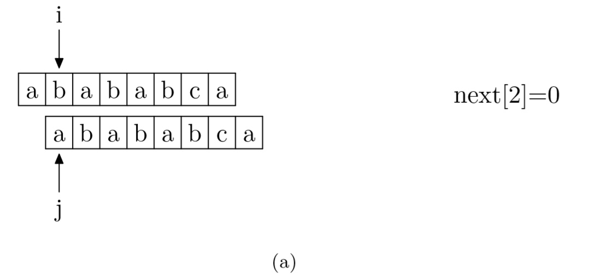
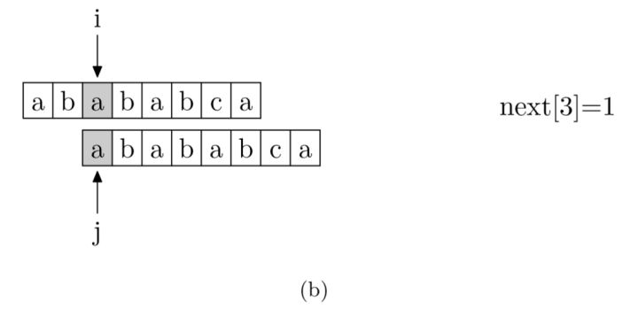
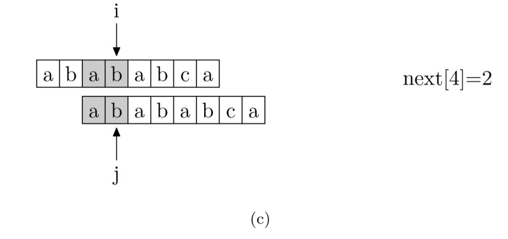
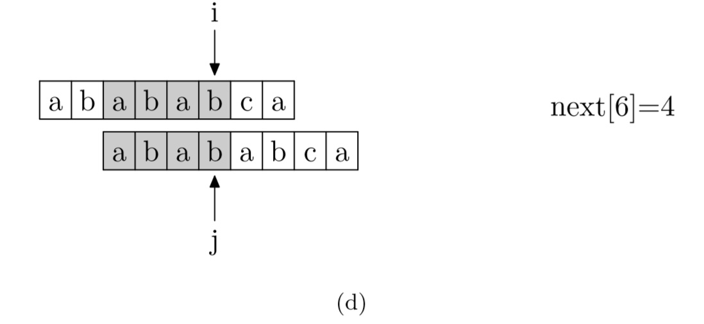
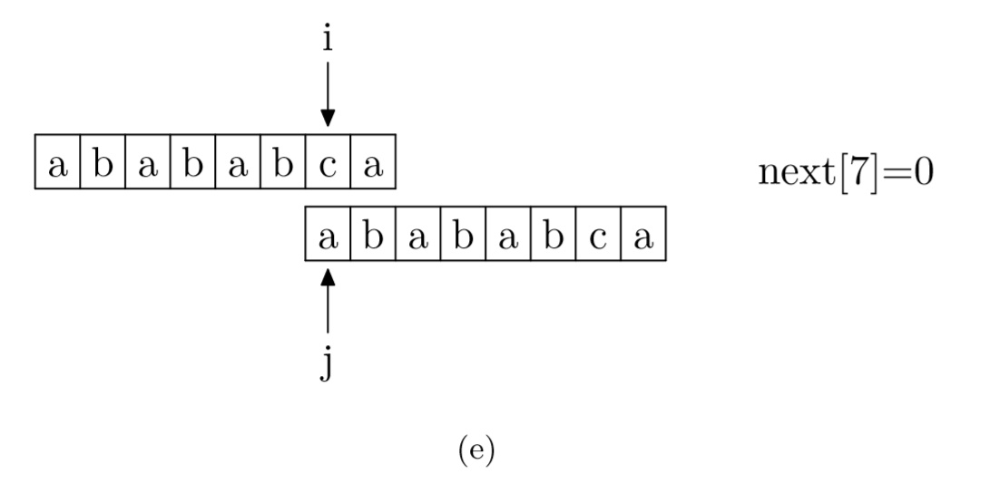

# String Utility

## KMP Algorithm

- intro

    In computer science, the Knuth–Morris–Pratt string-searching algorithm (or KMP algorithm) searches for occurrences of a "word" W within a main "text string" S by employing the observation that when a mismatch occurs, the word itself embodies sufficient information to determine where the next match could begin, thus bypassing re-examination of previously matched characters.

- algorithm

  - How to calculate the next array value? The **pattern string** will stagger one position and compare itself.
    
    
    
    
    

- core code

    ```C
    int* getNextArray(const char* pattern)
    {
        int len = strlen(pattern);

        // Next array records the new beginning index of pattern string if the character is a mismatch between main string and pattern string.
        int* next = (int*)calloc(len, sizeof(int));
        next[0] = -1;

        int i = 0;
        int newStart = -1;       // This variable not only means the new beginning index of pattern string, but also is to traverse the other pattern string.

        // Note that at first, the pattern string will stagger one position and compare itself,
        // then it will get the result which is the intersection of longest prefix substring and longest suffix substring.
        while (i < len - 1)
        {
            if (newStart == -1 || pattern[i] == pattern[newStart])
            {
                next[++i] = ++newStart;
            }
            else
            {
                // If mismatch, then move to proper position according to the next array.
                newStart = next[newStart];
            }
        }
        return next;
    }

    int kmp(char* text, char* pattern)
    {
        int textLen = strlen(text);
        int patternLen = strlen(pattern);
        int textIndex = 0, patternIndex = 0;
        int* next = getNextArray(pattern);

        while (textIndex < textLen && patternIndex < patternLen)
        {
            // Note that "patternIndex = -1" means there is no any matching substring, so both index are all right shift and compare.
            if (patternIndex == -1 || text[textIndex] == pattern[patternIndex])
            {
                ++textIndex;
                ++patternIndex;
            }
            else
                patternIndex = next[patternIndex];
        }

        if (patternIndex == patternLen)
            return textIndex - patternIndex;
        else
            return -1;
    }
    ```

## Manacher Algorithm

Refer to <https://subetter.com/algorithm/manacher-algorithm.html>

## Longest Common Substring

Refer to <https://zhuanlan.zhihu.com/p/47597440>
